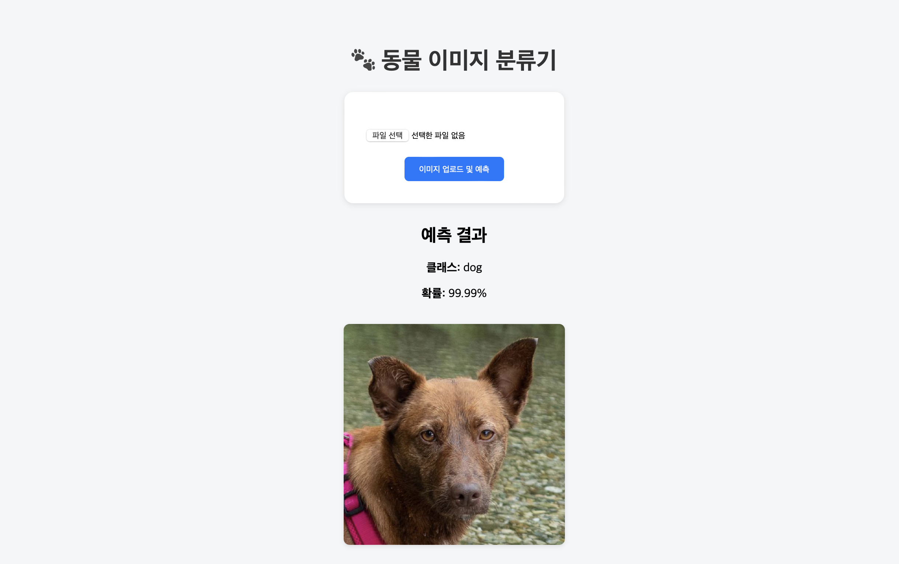

# 🐾 Find Your Look-Alike Animal



<p align="center">
  
  
  
  
</p>

---

## 🦊 What is this?

**Find Your Look-Alike Animal** is a fun deep learning web app that tells you  
which animal you resemble the most 🐱🐶🦁  
Upload your photo, and the model predicts your look-alike animal instantly!

---

## 🚀 Features
- 🖼 **Image Upload** – Upload any face photo directly through your browser  
- 🧠 **AI-Powered Prediction** – ResNet-18 model trained on animal face dataset  
- 🎯 **High Accuracy** – Returns top-1 prediction with probability  
- 🌐 **Interactive UI** – Clean Flask web interface with real-time feedback  
- 💾 **Lightweight Deployment** – Works on local or cloud server  

---

## 🧰 Tech Stack

| Component | Description |
|------------|-------------|
| **Backend** | Flask (Python) |
| **Model** | PyTorch (ResNet-18) |
| **Frontend** | HTML, CSS (Jinja2 Template) |
| **Deployment** | Flask Development Server / Render / AWS EC2 |

---

## ⚙️ Installation & Run

```bash
# 1️⃣ Clone the repository
git clone https://github.com/Jaehyeon-kr/Find_Your_Look_Alike_Animal.git
cd Find_Your_Look_Alike_Animal

# 2️⃣ Install dependencies
pip install -r requirements.txt

# 3️⃣ Run the Flask app
python app.py
